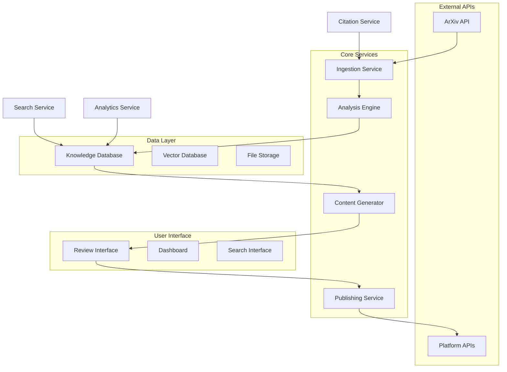
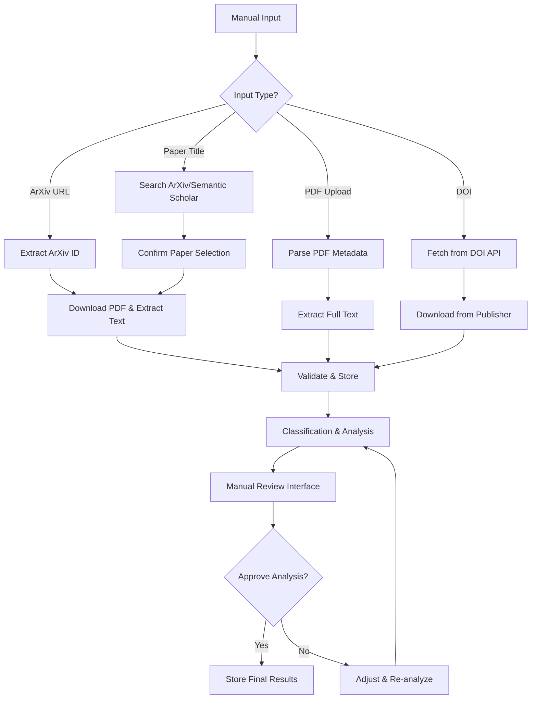
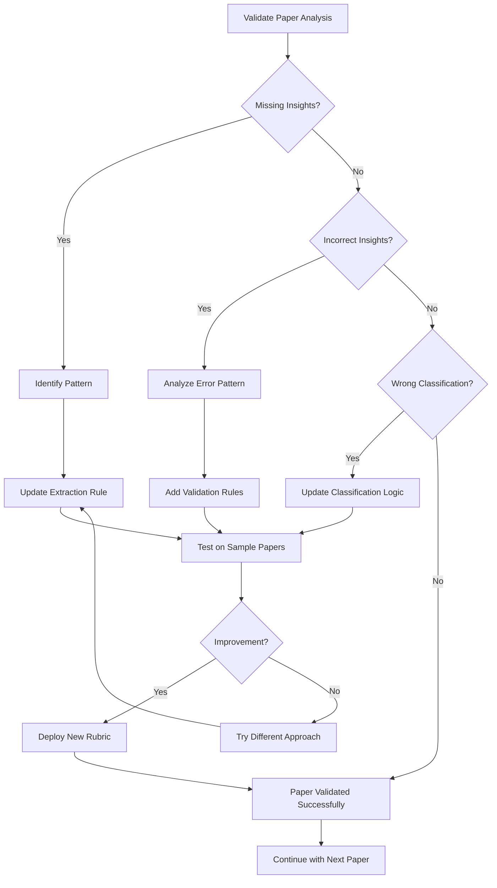

# Design Document

## Overview

The ArXiv Content Automation System is designed as a multi-layered architecture that ingests research papers, performs deep analysis using configurable rubrics, maintains a rich knowledge graph of relationships, and generates platform-specific content with human oversight. The system emphasizes scalability, data integrity, and flexible querying to support both automated workflows and human exploration.

## Architecture

### High-Level Architecture



### Database Design

The system uses a hybrid approach combining relational data for structured information and vector storage for semantic search capabilities.

#### Core Database Schema

**Papers Table**
```sql
CREATE TABLE papers (
    id UUID PRIMARY KEY,
    arxiv_id VARCHAR(50) UNIQUE NOT NULL,
    title TEXT NOT NULL,
    abstract TEXT,
    authors JSONB, -- Array of author objects with names, affiliations
    publication_date DATE,
    categories JSONB, -- ArXiv categories
    pdf_url TEXT,
    full_text TEXT,
    citation_count INTEGER DEFAULT 0,
    created_at TIMESTAMP DEFAULT NOW(),
    updated_at TIMESTAMP DEFAULT NOW(),
    
    -- Classification fields
    paper_type paper_type_enum NOT NULL,
    evidence_strength evidence_strength_enum NOT NULL,
    novelty_score DECIMAL(3,2), -- 0.00 to 1.00
    practical_applicability practical_applicability_enum,
    
    -- Analysis metadata
    analysis_status analysis_status_enum DEFAULT 'pending',
    analysis_confidence DECIMAL(3,2),
    extraction_version INTEGER DEFAULT 1,
    
    -- Content generation tracking
    content_generated BOOLEAN DEFAULT FALSE,
    content_approved BOOLEAN DEFAULT FALSE
);

-- Enums
CREATE TYPE paper_type_enum AS ENUM (
    'conceptual_framework', 'survey_review', 'empirical_study', 
    'case_study', 'benchmark_comparison', 'position_paper', 'tutorial_methodology'
);

CREATE TYPE evidence_strength_enum AS ENUM (
    'experimental', 'theoretical', 'observational', 'anecdotal'
);

CREATE TYPE practical_applicability_enum AS ENUM (
    'high', 'medium', 'low', 'theoretical_only'
);

CREATE TYPE analysis_status_enum AS ENUM (
    'pending', 'in_progress', 'completed', 'failed', 'manual_review'
);
```

**Tags and Tagging System**
```sql
CREATE TABLE tags (
    id UUID PRIMARY KEY,
    name VARCHAR(100) UNIQUE NOT NULL,
    category tag_category_enum NOT NULL,
    description TEXT,
    parent_tag_id UUID REFERENCES tags(id),
    created_at TIMESTAMP DEFAULT NOW()
);

CREATE TYPE tag_category_enum AS ENUM (
    'research_domain', 'concept', 'methodology', 'application', 'innovation_marker'
);

CREATE TABLE paper_tags (
    paper_id UUID REFERENCES papers(id) ON DELETE CASCADE,
    tag_id UUID REFERENCES tags(id) ON DELETE CASCADE,
    confidence DECIMAL(3,2), -- How confident we are in this tag
    source tag_source_enum, -- How this tag was assigned
    created_at TIMESTAMP DEFAULT NOW(),
    PRIMARY KEY (paper_id, tag_id)
);

CREATE TYPE tag_source_enum AS ENUM (
    'automatic', 'manual', 'user_override'
);
```

**Citations and References**
```sql
CREATE TABLE citations (
    id UUID PRIMARY KEY,
    citing_paper_id UUID REFERENCES papers(id) ON DELETE CASCADE,
    cited_paper_id UUID REFERENCES papers(id) ON DELETE CASCADE,
    citation_context TEXT, -- Surrounding text where citation appears
    citation_type citation_type_enum,
    created_at TIMESTAMP DEFAULT NOW(),
    UNIQUE(citing_paper_id, cited_paper_id)
);

CREATE TYPE citation_type_enum AS ENUM (
    'builds_upon', 'contradicts', 'extends', 'applies', 'surveys', 'compares'
);

-- External citations (papers not in our system yet)
CREATE TABLE external_citations (
    id UUID PRIMARY KEY,
    citing_paper_id UUID REFERENCES papers(id) ON DELETE CASCADE,
    title TEXT,
    authors TEXT,
    publication_year INTEGER,
    venue TEXT,
    external_citation_count INTEGER, -- How many times this external paper is cited
    priority_score DECIMAL(3,2), -- Priority for backfill ingestion
    ingestion_status ingestion_status_enum DEFAULT 'not_queued',
    created_at TIMESTAMP DEFAULT NOW()
);

CREATE TYPE ingestion_status_enum AS ENUM (
    'not_queued', 'queued', 'in_progress', 'completed', 'failed'
);
```

**Extracted Insights**
```sql
CREATE TABLE insights (
    id UUID PRIMARY KEY,
    paper_id UUID REFERENCES papers(id) ON DELETE CASCADE,
    insight_type insight_type_enum NOT NULL,
    title VARCHAR(200) NOT NULL,
    description TEXT,
    content JSONB, -- Structured content specific to insight type
    confidence DECIMAL(3,2),
    extraction_method VARCHAR(50), -- Which analysis method extracted this
    created_at TIMESTAMP DEFAULT NOW()
);

CREATE TYPE insight_type_enum AS ENUM (
    'framework', 'concept', 'data_point', 'methodology', 'limitation', 
    'application', 'future_work', 'key_finding'
);

-- Link insights to tags for better organization
CREATE TABLE insight_tags (
    insight_id UUID REFERENCES insights(id) ON DELETE CASCADE,
    tag_id UUID REFERENCES tags(id) ON DELETE CASCADE,
    PRIMARY KEY (insight_id, tag_id)
);
```

**Content Generation and Publishing**
```sql
CREATE TABLE generated_content (
    id UUID PRIMARY KEY,
    paper_id UUID REFERENCES papers(id) ON DELETE CASCADE,
    platform platform_enum NOT NULL,
    content_type content_type_enum NOT NULL,
    title VARCHAR(500),
    content TEXT NOT NULL,
    metadata JSONB, -- Platform-specific metadata
    
    -- Workflow status
    generation_status generation_status_enum DEFAULT 'draft',
    human_review_status review_status_enum DEFAULT 'pending',
    publication_status publication_status_enum DEFAULT 'not_published',
    
    -- Timestamps
    generated_at TIMESTAMP DEFAULT NOW(),
    reviewed_at TIMESTAMP,
    published_at TIMESTAMP,
    
    -- Publishing details
    published_url TEXT,
    platform_id TEXT, -- Platform-specific post ID
    
    -- Analytics
    engagement_metrics JSONB
);

CREATE TYPE platform_enum AS ENUM (
    'substack', 'linkedin', 'twitter_x', 'medium', 'blog'
);

CREATE TYPE content_type_enum AS ENUM (
    'blog_post', 'social_post', 'thread', 'newsletter', 'summary'
);

CREATE TYPE generation_status_enum AS ENUM (
    'draft', 'generated', 'regenerating', 'failed'
);

CREATE TYPE review_status_enum AS ENUM (
    'pending', 'approved', 'rejected', 'needs_revision'
);

CREATE TYPE publication_status_enum AS ENUM (
    'not_published', 'scheduled', 'published', 'failed'
);
```

**Content Relationships and Cross-References**
```sql
CREATE TABLE content_references (
    id UUID PRIMARY KEY,
    source_content_id UUID REFERENCES generated_content(id) ON DELETE CASCADE,
    referenced_paper_id UUID REFERENCES papers(id) ON DELETE CASCADE,
    reference_type reference_type_enum,
    context_snippet TEXT,
    created_at TIMESTAMP DEFAULT NOW()
);

CREATE TYPE reference_type_enum AS ENUM (
    'primary_source', 'supporting_evidence', 'related_work', 'comparison', 'background'
);
```

#### Vector Database Schema

For semantic search and similarity matching:

```sql
-- Vector embeddings for papers
CREATE TABLE paper_embeddings (
    paper_id UUID REFERENCES papers(id) ON DELETE CASCADE,
    embedding_type embedding_type_enum,
    embedding VECTOR(1536), -- Assuming OpenAI embeddings
    created_at TIMESTAMP DEFAULT NOW(),
    PRIMARY KEY (paper_id, embedding_type)
);

CREATE TYPE embedding_type_enum AS ENUM (
    'title_abstract', 'full_text', 'insights_summary'
);

-- Vector embeddings for insights
CREATE TABLE insight_embeddings (
    insight_id UUID REFERENCES insights(id) ON DELETE CASCADE,
    embedding VECTOR(1536),
    created_at TIMESTAMP DEFAULT NOW(),
    PRIMARY KEY (insight_id)
);
```

#### Indexes for Performance

```sql
-- Core search indexes
CREATE INDEX idx_papers_publication_date ON papers(publication_date DESC);
CREATE INDEX idx_papers_paper_type ON papers(paper_type);
CREATE INDEX idx_papers_novelty_score ON papers(novelty_score DESC);
CREATE INDEX idx_papers_analysis_status ON papers(analysis_status);

-- Tag search indexes
CREATE INDEX idx_tags_category ON tags(category);
CREATE INDEX idx_tags_name ON tags(name);
CREATE INDEX idx_paper_tags_confidence ON paper_tags(confidence DESC);

-- Citation indexes
CREATE INDEX idx_citations_citing_paper ON citations(citing_paper_id);
CREATE INDEX idx_citations_cited_paper ON citations(cited_paper_id);
CREATE INDEX idx_external_citations_priority ON external_citations(priority_score DESC);

-- Content workflow indexes
CREATE INDEX idx_generated_content_status ON generated_content(generation_status, human_review_status);
CREATE INDEX idx_generated_content_platform ON generated_content(platform, publication_status);

-- Vector similarity indexes (using pgvector)
CREATE INDEX idx_paper_embeddings_vector ON paper_embeddings USING ivfflat (embedding vector_cosine_ops);
CREATE INDEX idx_insight_embeddings_vector ON insight_embeddings USING ivfflat (embedding vector_cosine_ops);
```

## Components and Interfaces

### 1. Ingestion Service

The Ingestion Service supports both automated discovery and manual paper addition for system validation and tuning.

#### Manual Ingestion Interface
```typescript
interface ManualIngestionRequest {
  source: 'arxiv_url' | 'pdf_upload' | 'paper_title' | 'doi';
  input: string; // URL, file path, title, or DOI
  metadata?: Partial<PaperMetadata>; // Optional pre-filled metadata
  analysisOverride?: {
    paperType?: PaperType;
    tags?: string[];
    skipAutoAnalysis?: boolean;
  };
}

interface PaperMetadata {
  title: string;
  authors: Author[];
  abstract: string;
  publicationDate: Date;
  venue?: string;
  categories: string[];
}
```

#### Ingestion Workflow


#### Manual Ingestion Components

**URL-based Ingestion**
```typescript
class URLIngestionHandler {
  async ingestFromArxivUrl(url: string): Promise<Paper> {
    // Extract ArXiv ID from URL patterns:
    // https://arxiv.org/abs/2301.12345
    // https://arxiv.org/pdf/2301.12345.pdf
    const arxivId = this.extractArxivId(url);
    
    // Fetch metadata from ArXiv API
    const metadata = await this.arxivClient.getMetadata(arxivId);
    
    // Download PDF and extract full text
    const pdfContent = await this.downloadPdf(metadata.pdfUrl);
    const fullText = await this.extractTextFromPdf(pdfContent);
    
    return this.createPaper({
      ...metadata,
      fullText,
      source: 'manual_arxiv_url'
    });
  }
  
  async ingestFromDOI(doi: string): Promise<Paper> {
    // Use CrossRef or publisher APIs to get metadata
    const metadata = await this.crossRefClient.getMetadata(doi);
    
    // Attempt to download PDF (may require institutional access)
    const pdfContent = await this.downloadFromPublisher(metadata.pdfUrl);
    const fullText = await this.extractTextFromPdf(pdfContent);
    
    return this.createPaper({
      ...metadata,
      fullText,
      source: 'manual_doi'
    });
  }
}
```

**PDF Upload Ingestion**
```typescript
class PDFIngestionHandler {
  async ingestFromPDF(filePath: string, userMetadata?: Partial<PaperMetadata>): Promise<Paper> {
    // Extract text from PDF
    const fullText = await this.extractTextFromPdf(filePath);
    
    // Try to extract metadata from PDF
    const extractedMetadata = await this.extractMetadataFromPDF(fullText);
    
    // Merge with user-provided metadata (user data takes precedence)
    const metadata = {
      ...extractedMetadata,
      ...userMetadata
    };
    
    // If we have a title, try to find the paper online for additional metadata
    if (metadata.title) {
      const onlineMetadata = await this.searchForPaperOnline(metadata.title);
      if (onlineMetadata && this.isLikelyMatch(metadata, onlineMetadata)) {
        metadata.arxivId = onlineMetadata.arxivId;
        metadata.doi = onlineMetadata.doi;
      }
    }
    
    return this.createPaper({
      ...metadata,
      fullText,
      source: 'manual_pdf_upload'
    });
  }
  
  private async extractMetadataFromPDF(text: string): Promise<Partial<PaperMetadata>> {
    // Use regex patterns and LLM to extract title, authors, abstract
    const titleMatch = text.match(/^(.{10,200})\n/); // First substantial line
    const abstractMatch = text.match(/Abstract\s*\n([\s\S]{100,2000}?)\n\n/i);
    
    return {
      title: titleMatch?.[1]?.trim(),
      abstract: abstractMatch?.[1]?.trim(),
      // Additional extraction logic...
    };
  }
}
```

**Title-based Search Ingestion**
```typescript
class TitleSearchIngestionHandler {
  async ingestFromTitle(title: string): Promise<Paper[]> {
    // Search multiple sources
    const [arxivResults, semanticScholarResults] = await Promise.all([
      this.searchArxiv(title),
      this.searchSemanticScholar(title)
    ]);
    
    // Combine and rank results by relevance
    const allResults = [...arxivResults, ...semanticScholarResults];
    const rankedResults = this.rankByTitleSimilarity(title, allResults);
    
    // Return top matches for user selection
    return rankedResults.slice(0, 5);
  }
  
  private rankByTitleSimilarity(query: string, results: Paper[]): Paper[] {
    return results
      .map(paper => ({
        ...paper,
        similarity: this.calculateTitleSimilarity(query, paper.title)
      }))
      .sort((a, b) => b.similarity - a.similarity);
  }
}
```

#### Manual Review and Tuning Interface

**Analysis Review Dashboard**
```typescript
interface AnalysisReviewInterface {
  paper: Paper;
  extractedInsights: Insight[];
  suggestedTags: Tag[];
  classificationResults: {
    paperType: PaperType;
    confidence: number;
    evidenceStrength: EvidenceStrength;
    practicalApplicability: PracticalApplicability;
  };
  
  // User feedback options
  corrections: {
    paperType?: PaperType;
    insights?: InsightCorrection[];
    tags?: TagCorrection[];
    confidence?: number;
  };
}

interface InsightCorrection {
  insightId: string;
  action: 'approve' | 'reject' | 'modify';
  modifiedContent?: any;
  feedback?: string;
}
```

**Feedback Loop for System Improvement**
```sql
-- Track manual corrections to improve rubrics
CREATE TABLE analysis_feedback (
    id UUID PRIMARY KEY,
    paper_id UUID REFERENCES papers(id),
    rubric_version_id UUID REFERENCES rubric_versions(id),
    original_classification JSONB,
    corrected_classification JSONB,
    user_feedback TEXT,
    correction_type feedback_type_enum,
    created_at TIMESTAMP DEFAULT NOW()
);

CREATE TYPE feedback_type_enum AS ENUM (
    'classification_error', 'insight_missing', 'insight_incorrect', 
    'tag_missing', 'tag_incorrect', 'confidence_too_high', 'confidence_too_low'
);
```

- **ArXiv API Client**: Fetches papers based on search criteria (for future automation)
- **Manual Ingestion Handlers**: Support URL, PDF, title, and DOI-based paper addition
- **Citation Extractor**: Parses references and builds citation graph
- **Duplicate Detector**: Prevents re-ingestion across all input methods
- **Analysis Review Interface**: Manual validation and correction of automated analysis
- **Feedback Loop**: Captures corrections to improve rubric accuracy over time

### 2. Analysis Engine

The Analysis Engine is the core component that transforms raw research papers into structured, searchable insights using configurable rubrics.

#### Analysis Rubric System

**Rubric Configuration**
```typescript
interface AnalysisRubric {
  id: string;
  name: string;
  version: string;
  paperTypes: PaperType[]; // Which paper types this rubric applies to
  domains: string[]; // Research domains this rubric is optimized for
  
  extractionRules: ExtractionRule[];
  classificationCriteria: ClassificationCriteria;
  qualityThresholds: QualityThresholds;
}

interface ExtractionRule {
  insightType: InsightType;
  prompt: string; // LLM prompt for extraction
  expectedStructure: JSONSchema; // Expected output format
  confidenceCalculation: ConfidenceRule;
  validationRules: ValidationRule[];
}
```

**Analysis Workflow Process**

1. **Paper Type Classification**
   ```mermaid
   graph TD
       A[Raw Paper] --> B[Initial Classification]
       B --> C{Paper Type?}
       C -->|Framework| D[Framework Rubric]
       C -->|Survey| E[Survey Rubric]
       C -->|Case Study| F[Case Study Rubric]
       C -->|Empirical| G[Empirical Rubric]
       
       D --> H[Extract Frameworks]
       E --> I[Extract Survey Insights]
       F --> J[Extract Applications]
       G --> K[Extract Experiments]
       
       H --> L[Store Structured Insights]
       I --> L
       J --> L
       K --> L
   ```

2. **Insight Extraction Pipeline**
   ```typescript
   class AnalysisEngine {
     async analyzePaper(paper: Paper): Promise<AnalysisResult> {
       // Step 1: Classify paper type and select rubric
       const paperType = await this.classifyPaper(paper);
       const rubric = await this.getRubricForType(paperType);
       
       // Step 2: Apply extraction rules
       const insights: Insight[] = [];
       for (const rule of rubric.extractionRules) {
         const extracted = await this.extractInsight(paper, rule);
         if (extracted.confidence >= rule.minimumConfidence) {
           insights.push(extracted);
         }
       }
       
       // Step 3: Cross-validate and score
       const validatedInsights = await this.validateInsights(insights);
       
       // Step 4: Generate embeddings for semantic search
       const embeddings = await this.generateEmbeddings(validatedInsights);
       
       return {
         paperType,
         insights: validatedInsights,
         embeddings,
         overallConfidence: this.calculateOverallConfidence(validatedInsights)
       };
     }
   }
   ```

#### Type-Specific Extraction Templates

**Framework Paper Rubric**
```yaml
framework_extraction:
  insights:
    - type: "framework"
      prompt: |
        Identify the main framework or methodology introduced in this paper.
        Extract: name, core components, key innovations, comparison to existing approaches.
      structure:
        name: string
        components: string[]
        innovations: string[]
        comparisons: object[]
    
    - type: "methodology"
      prompt: |
        Describe the step-by-step methodology or process outlined.
        Extract: steps, inputs, outputs, validation approach.
      structure:
        steps: object[]
        inputs: string[]
        outputs: string[]
        validation: string
```

**Case Study Paper Rubric**
```yaml
case_study_extraction:
  insights:
    - type: "application"
      prompt: |
        Identify the specific application or use case being demonstrated.
        Extract: problem domain, solution approach, implementation details, results.
      structure:
        domain: string
        problem: string
        solution: string
        implementation: object
        results: object[]
    
    - type: "data_point"
      prompt: |
        Extract quantitative results, performance metrics, and statistical findings.
        Extract: metrics, values, comparisons, statistical significance.
      structure:
        metrics: object[]
        comparisons: object[]
        significance: string
```

#### Database Storage Process

**Insight Storage Workflow**
```sql
-- Example of how a framework insight gets stored
INSERT INTO insights (id, paper_id, insight_type, title, description, content, confidence)
VALUES (
  gen_random_uuid(),
  '123e4567-e89b-12d3-a456-426614174000',
  'framework',
  'ReAct: Reasoning and Acting Framework',
  'A framework combining reasoning and acting in language models',
  '{
    "name": "ReAct",
    "components": ["reasoning", "acting", "observation"],
    "innovations": ["interleaved reasoning and acting", "dynamic planning"],
    "comparisons": [
      {"baseline": "Chain-of-Thought", "improvement": "better error recovery"},
      {"baseline": "Standard prompting", "improvement": "more robust planning"}
    ]
  }',
  0.92
);

-- Link to relevant tags
INSERT INTO insight_tags (insight_id, tag_id)
SELECT 
  i.id,
  t.id
FROM insights i, tags t
WHERE i.title = 'ReAct: Reasoning and Acting Framework'
  AND t.name IN ('reasoning', 'language-models', 'planning', 'frameworks');
```

#### Quality Control and Confidence Scoring

**Confidence Calculation**
```typescript
interface ConfidenceFactors {
  extractionClarity: number; // How clear was the extraction from text
  structureCompleteness: number; // How complete is the structured data
  crossValidation: number; // Agreement with other extraction methods
  domainRelevance: number; // Relevance to expected domain
}

function calculateConfidence(factors: ConfidenceFactors): number {
  return (
    factors.extractionClarity * 0.4 +
    factors.structureCompleteness * 0.3 +
    factors.crossValidation * 0.2 +
    factors.domainRelevance * 0.1
  );
}
```

**Quality Thresholds and Escalation**
```typescript
const QUALITY_THRESHOLDS = {
  AUTO_APPROVE: 0.85,
  MANUAL_REVIEW: 0.60,
  AUTO_REJECT: 0.40
};

async function processAnalysisResult(result: AnalysisResult) {
  if (result.overallConfidence >= QUALITY_THRESHOLDS.AUTO_APPROVE) {
    await storeInsights(result.insights);
    await updatePaperStatus(result.paperId, 'completed');
  } else if (result.overallConfidence >= QUALITY_THRESHOLDS.MANUAL_REVIEW) {
    await flagForManualReview(result);
    await updatePaperStatus(result.paperId, 'manual_review');
  } else {
    await logAnalysisFailure(result);
    await updatePaperStatus(result.paperId, 'failed');
  }
}
```

#### Rubric Evolution and Learning

**Rubric Versioning**
```sql
CREATE TABLE rubric_versions (
    id UUID PRIMARY KEY,
    rubric_name VARCHAR(100),
    version VARCHAR(20),
    config JSONB,
    performance_metrics JSONB,
    created_at TIMESTAMP DEFAULT NOW(),
    is_active BOOLEAN DEFAULT FALSE
);

-- Track which rubric version was used for each analysis
ALTER TABLE papers ADD COLUMN rubric_version_id UUID REFERENCES rubric_versions(id);
```

**Performance Tracking**
```typescript
interface RubricPerformance {
  version: string;
  totalPapers: number;
  averageConfidence: number;
  manualReviewRate: number;
  userSatisfactionScore: number;
  insightAccuracy: number;
}

// Continuously monitor and improve rubrics
async function evaluateRubricPerformance(rubricId: string): Promise<RubricPerformance> {
  const papers = await getPapersAnalyzedWithRubric(rubricId);
  return {
    version: rubric.version,
    totalPapers: papers.length,
    averageConfidence: calculateAverageConfidence(papers),
    manualReviewRate: calculateManualReviewRate(papers),
    userSatisfactionScore: await getUserFeedbackScore(papers),
    insightAccuracy: await validateInsightAccuracy(papers)
  };
}
```

- **Rubric Processor**: Applies configurable analysis templates based on paper type
- **Classification Service**: Categorizes papers and selects appropriate rubrics
- **Insight Extractor**: Uses LLM prompts to extract structured insights with confidence scoring
- **Embedding Generator**: Creates vector representations for semantic search
- **Quality Controller**: Manages confidence thresholds and escalation to manual review

### 3. Knowledge Database
- **Relational Store**: PostgreSQL with structured schema
- **Vector Store**: pgvector for similarity search
- **File Storage**: S3-compatible storage for PDFs and full text
- **Search Service**: Combines SQL queries with vector similarity

### 4. Content Generator
- **Template Engine**: Platform-specific content templates
- **Style Manager**: Maintains consistent voice across platforms
- **Cross-Reference Engine**: Identifies relevant connections to existing content
- **Quality Scorer**: Evaluates generated content quality

### 5. Review Interface
- **Content Dashboard**: Human review and approval workflow
- **Batch Operations**: Bulk approve/reject/edit capabilities
- **Analytics View**: Content performance and engagement metrics
- **Search and Filter**: Find content by status, platform, or source paper

## Data Models

### Paper Model
```typescript
interface Paper {
  id: string;
  arxivId: string;
  title: string;
  abstract: string;
  authors: Author[];
  publicationDate: Date;
  categories: string[];
  
  // Classification
  paperType: PaperType;
  evidenceStrength: EvidenceStrength;
  noveltyScore: number;
  practicalApplicability: PracticalApplicability;
  
  // Analysis
  analysisStatus: AnalysisStatus;
  analysisConfidence: number;
  insights: Insight[];
  tags: Tag[];
  
  // Relationships
  citations: Citation[];
  citedBy: Citation[];
  
  // Content
  generatedContent: GeneratedContent[];
}
```

### Insight Model
```typescript
interface Insight {
  id: string;
  paperId: string;
  type: InsightType;
  title: string;
  description: string;
  content: Record<string, any>; // Type-specific structured data
  confidence: number;
  tags: Tag[];
}
```

### Generated Content Model
```typescript
interface GeneratedContent {
  id: string;
  paperId: string;
  platform: Platform;
  contentType: ContentType;
  title: string;
  content: string;
  metadata: PlatformMetadata;
  
  // Workflow
  generationStatus: GenerationStatus;
  reviewStatus: ReviewStatus;
  publicationStatus: PublicationStatus;
  
  // References
  references: ContentReference[];
  
  // Analytics
  engagementMetrics: EngagementMetrics;
}
```

## Error Handling

### Database Error Handling
- **Connection Failures**: Automatic retry with exponential backoff
- **Constraint Violations**: Graceful handling of duplicate entries
- **Transaction Rollbacks**: Ensure data consistency during complex operations
- **Migration Safety**: Zero-downtime schema updates

### Data Quality Assurance
- **Validation Rules**: Enforce data integrity at application and database levels
- **Confidence Scoring**: Track reliability of automated extractions
- **Manual Review Flags**: Escalate low-confidence or failed analyses
- **Audit Logging**: Track all data modifications for debugging

## Manual Validation and System Tuning

### Phase 1: Manual Paper Ingestion and Validation

**Validation Workflow**
1. **Manual Paper Addition**: Add papers from your Notion database using multiple input methods
2. **Analysis Review**: Evaluate automated classification and insight extraction
3. **Correction and Feedback**: Adjust results and provide feedback for system learning
4. **Rubric Refinement**: Update analysis templates based on validation results
5. **Confidence Calibration**: Adjust confidence thresholds based on accuracy

**Validation Interface Features**
```typescript
interface ValidationDashboard {
  // Paper queue for validation
  pendingPapers: Paper[];
  
  // Side-by-side comparison
  comparison: {
    automated: AnalysisResult;
    manual: ManualAnalysis;
    differences: Difference[];
  };
  
  // Batch operations
  batchActions: {
    approveAll: () => void;
    rejectAll: () => void;
    applyCorrections: (corrections: Correction[]) => void;
  };
  
  // System metrics
  metrics: {
    accuracyRate: number;
    averageConfidence: number;
    manualReviewRate: number;
    commonErrors: ErrorPattern[];
  };
}
```

**Rubric Fine-Tuning Process**

The system allows you to iteratively refine analysis rubrics based on validation feedback:

```typescript
interface RubricTuningInterface {
  // Current rubric performance
  currentRubric: AnalysisRubric;
  performanceMetrics: {
    insightAccuracy: number;
    classificationAccuracy: number;
    missedInsights: InsightGap[];
    incorrectInsights: InsightError[];
  };
  
  // Tuning options
  tuningActions: {
    addExtractionRule: (rule: ExtractionRule) => void;
    modifyPrompt: (ruleId: string, newPrompt: string) => void;
    adjustConfidenceThreshold: (ruleId: string, threshold: number) => void;
    addValidationRule: (ruleId: string, validation: ValidationRule) => void;
  };
  
  // A/B testing
  experimentalRubrics: AnalysisRubric[];
  compareResults: (rubricA: string, rubricB: string) => ComparisonResult;
}
```

**Common Rubric Adjustments**

1. **Missing Insights**: When you notice the system consistently misses certain types of insights
```yaml
# Before: Generic methodology extraction
methodology_extraction:
  prompt: "Describe the methodology used in this paper"
  
# After: More specific prompt based on your feedback
methodology_extraction:
  prompt: |
    Extract the specific methodology with focus on:
    1. Data collection approach and sample size
    2. Experimental design and control variables  
    3. Evaluation metrics and statistical tests used
    4. Reproducibility information (code, datasets)
```

2. **Incorrect Classifications**: When papers are consistently misclassified
```typescript
// Add domain-specific classification rules
const frameworkClassificationRules = [
  {
    condition: "paper introduces new architecture or model",
    indicators: ["propose", "introduce", "novel architecture", "new framework"],
    weight: 0.8
  },
  {
    condition: "paper compares multiple existing approaches", 
    indicators: ["comparison", "benchmark", "evaluate", "survey"],
    weight: -0.6 // Negative weight against framework classification
  }
];
```

3. **Confidence Calibration**: Adjust thresholds based on actual accuracy
```typescript
// Track actual vs predicted accuracy
interface ConfidenceCalibration {
  confidenceRange: [number, number]; // e.g., [0.8, 0.9]
  predictedAccuracy: number; // What system thought accuracy would be
  actualAccuracy: number; // What you validated it to be
  sampleSize: number;
}

// Adjust thresholds based on calibration data
function recalibrateConfidence(calibrationData: ConfidenceCalibration[]) {
  // If system is overconfident, lower thresholds
  // If system is underconfident, raise thresholds
}
```

**Rubric Versioning and Experimentation**
```sql
-- Track rubric evolution
CREATE TABLE rubric_experiments (
    id UUID PRIMARY KEY,
    base_rubric_id UUID REFERENCES rubric_versions(id),
    experimental_rubric_id UUID REFERENCES rubric_versions(id),
    test_papers UUID[], -- Papers used for A/B testing
    results JSONB, -- Comparative performance metrics
    winner rubric_winner_enum,
    created_at TIMESTAMP DEFAULT NOW()
);

CREATE TYPE rubric_winner_enum AS ENUM ('base', 'experimental', 'inconclusive');
```

**Iterative Improvement Workflow**


**Example Tuning Session**
```typescript
// You notice the system missed extracting performance metrics from case studies
const feedback = {
  paperId: "case-study-123",
  missedInsights: [
    {
      type: "data_point",
      content: "Achieved 94% accuracy on GLUE benchmark",
      location: "Results section, paragraph 2"
    }
  ]
};

// System suggests rubric improvement
const suggestion = {
  action: "add_extraction_rule",
  rule: {
    insightType: "data_point",
    prompt: `
      Look specifically for quantitative results and performance metrics.
      Extract: metric name, value, benchmark/dataset, comparison to baselines.
      Pay special attention to Results and Evaluation sections.
    `,
    validationRules: [
      "Must include numeric value",
      "Must specify what was measured",
      "Should include comparison context if available"
    ]
  }
};
```

This system learns from every correction you make, gradually becoming more accurate at extracting the specific insights you care about most.

### Phase 2: Automated Ingestion Preparation

Once manual validation achieves target accuracy (e.g., >90% classification accuracy, >85% insight extraction accuracy), the system can transition to automated ArXiv ingestion with the refined rubrics and confidence thresholds.

**Success Criteria for Automation**
- Classification accuracy > 90%
- Insight extraction accuracy > 85%
- Manual review rate < 15%
- User satisfaction score > 4.0/5.0

## Testing Strategy

### Database Testing
- **Unit Tests**: Individual model validation and business logic
- **Integration Tests**: End-to-end workflows with test database
- **Performance Tests**: Query optimization and load testing
- **Migration Tests**: Schema change validation

### Data Pipeline Testing
- **Mock ArXiv Responses**: Test ingestion with known paper data
- **Analysis Validation**: Compare automated extraction with manual analysis
- **Content Quality Tests**: Evaluate generated content against style guidelines
- **Cross-Reference Accuracy**: Validate relationship detection algorithms

### User Interface Testing
- **Review Workflow**: Test approval/rejection flows
- **Search Functionality**: Validate filtering and discovery features
- **Publishing Integration**: Mock platform APIs for testing
- **Analytics Accuracy**: Verify engagement metric collection